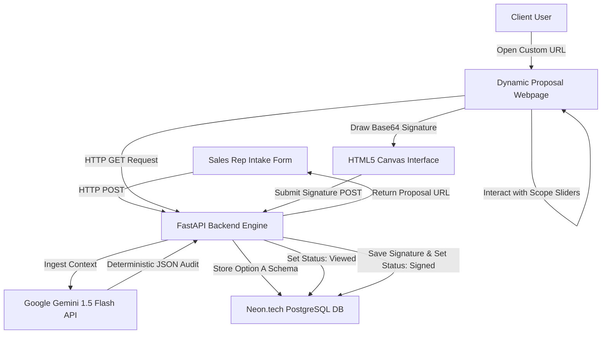

# VisionPitch 

VisionPitch is an automated sales proposal and business intelligence platform. It replaces tedious manual client research, competitor analysis, and static document creation with a lightning-fast, interactive generation pipeline.

Designed under a **Sovereign Minimalist** dark theme, it empowers sales representatives to generate bespoke proposals in seconds, and provides prospective clients with a live interactive portal to modify pricing and sign proposals digitally.

---

## 1. Conceptual Strategy (System Overview)

VisionPitch acts as a full-stack, decoupled application that streamlines the sales intake, AI audit, dynamic proposal customized negotiation, and final client sign-off lifecycle.



### Key Workflows:
1. **Sales Intake**: A sales representative inputs a business profile (enforcing a constraint that at least a website URL or social media URL is present).
2. **AI-Powered Audit**: The backend queries Google Gemini 1.5 Flash with a rigid prompt, returning a structured JSON document covering Sentiment, Competitors, and Service recommendations.
3. **Link Masking**: The database persists the proposal using a secure, randomized `proposal_hash` URL key instead of database integer IDs.
4. **Negotiation and Adjustment**: The client reviews their custom web proposal and adjusts scope multipliers via real-time pricing sliders.
5. **Secure Sign-Off**: The client signs their name on an interactive HTML5 canvas, which exports the drawing as a Base64 string saved directly into the database.

---

## 2. Architecture Deep Dive & Technology Stack

The application relies on a decoupled full-stack architecture:

| Component | Technology | Rationale |
| :--- | :--- | :--- |
| **Frontend UI** | HTML5, CSS3, Tailwind CSS CDN | Delivers lightweight, ultra-fast dark-mode styling with zero build pipelines. |
| **Frontend Logic** | Vanilla JavaScript (ES6+) | Direct, framework-free browser execution for slider math, Canvas API strokes, and async `fetch()` requests. |
| **Backend API** | Python 3.11+ / FastAPI | Async framework with Pydantic serialization for high concurrency and native request verification. |
| **Database** | PostgreSQL (`psycopg2-binary`) | Neon.tech / Render cloud cluster guaranteeing transaction persistence, relational constraints, and durability. |
| **AI Orchestrator** | Google Gemini 1.5 Flash | The official `google-genai` package for high-speed contextual auditing with deterministic JSON mode schema targets. |

---

## 3. Database Schema

The persistence layer implements a relational database structure designed for fast retrieval and data integrity:

### 3.1 `clients` Table
Stores contact information, validation targets, and proposal lifecycle states.
- `client_id` (SERIAL, Primary Key)
- `client_name` (TEXT, Not Null)
- `company_name` (TEXT, Not Null)
- `industry` (TEXT, Not Null)
- `website_url` (TEXT, Nullable)
- `social_media_urls` (TEXT, Nullable)
- `budget` (REAL, Not Null)
- `client_status` (TEXT, Default: `'Proposal generated'`)
  - *Lifecycle States:* `'Proposal generated'`, `'Proposal sent'`, `'Proposal viewed'`, `'Proposal signed'`, `'Proposal declined'`.
- *Constraints*: Enforces a check validation that both `website_url` and `social_media_urls` cannot be null simultaneously (`url_presence` constraint).

### 3.2 `proposals` Table
Caches structural AI analysis blocks, proposal access tokens, and digital signatures.
- `proposal_id` (SERIAL, Primary Key)
- `client_id` (INTEGER, Foreign Key referencing `clients(client_id)` with `ON DELETE CASCADE`)
- `proposal_hash` (VARCHAR(50), Unique, Not Null)
- `audit_raw_json` (TEXT, Contains full structured AI analysis, gaps, and benchmarks)
- `recommended_services` (TEXT, Contains recommended services array)
- `final_price` (REAL, Final computed invoice value)
- `signature_data` (TEXT, Base64 drawing representation)

---

## 4. Setup & Running Locally

### 4.1 Prerequisites
- **Python 3.11+** installed
- A **PostgreSQL Database URL** (e.g., Neon.tech)
- A **Google Gemini API Key** (from Google AI Studio)

### 4.2 Backend Setup
1. Navigate to the backend directory:
   ```bash
   cd backend
   ```
2. Create and activate a virtual environment:
   ```bash
   python -m venv venv
   # On Windows:
   .\venv\Scripts\activate
   # On macOS/Linux:
   source venv/bin/activate
   ```
3. Install required dependencies:
   ```bash
   pip install -r requirements.txt
   ```
4. Create a `.env` file in the `backend/` directory:
   ```env
   DATABASE_URL=postgresql://<user>:<password>@<host>/<dbname>?sslmode=require
   GEMINI_API_KEY=your_gemini_api_key_here
   ```
5. Initialize the database schema:
   ```bash
   python database.py
   ```
6. Start the FastAPI development server:
   ```bash
   uvicorn main:app --reload
   ```

### 4.3 Frontend Setup
The frontend is built with static files .
1. Serve the `frontend/` directory using any local server, or open `index.html` directly in your browser.
2. If using Python:
   ```bash
   cd frontend
   python -m http.server 8080
   ```
   *Open `http://127.0.0.1:8080` in your web browser.*

---

## 5. Verification & Testing

Verify system stability and calculations using automated tests built inside the `pytest` framework.

1. Navigate to the `backend` folder.
2. Run tests:
   ```bash
   pytest
   ```
   This executes:
   - **Pricing Engine Math**: Validates dynamic service sliders, rush adjustments, and price recalculations.
   - **Form Sanitization Logic**: Confirms that fields block script injections and strip HTML before compiling prompts.

---

## 6. Defensive Error Management

The application features explicit defensive safeguards against core runtime vulnerabilities:
- **API Outage Protection**: Catches `google-genai` service outages, timeouts, or rate limits. The system uses try-except blocks to route a local pre-cached fallback analysis object instead of crashing.
- **Hash Integrity Check**: Gracefully intercepts invalid proposal hashes or malicious SQL strings. If a lookup returns empty database records, the backend responds with a structured `404 Not Found` response instead of exposing raw SQL logs.
